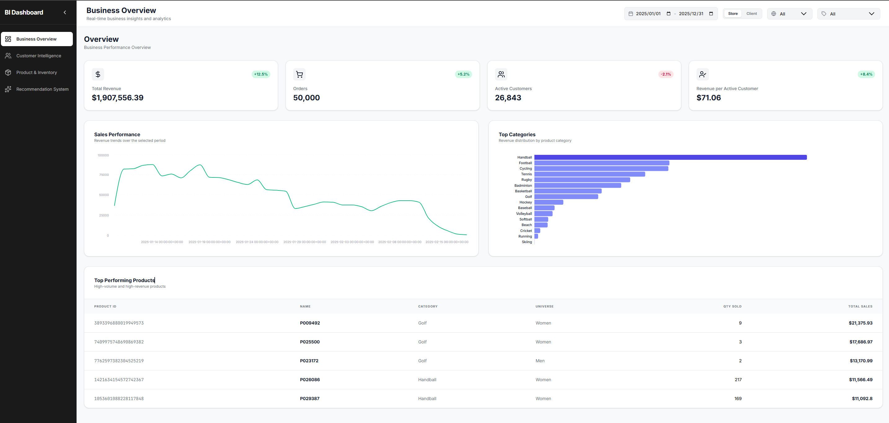
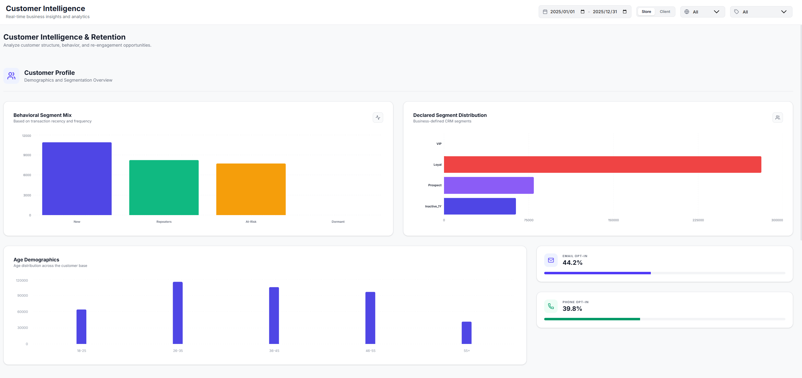
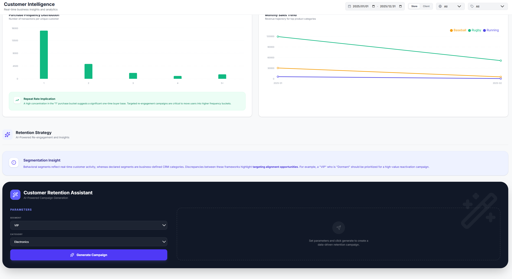
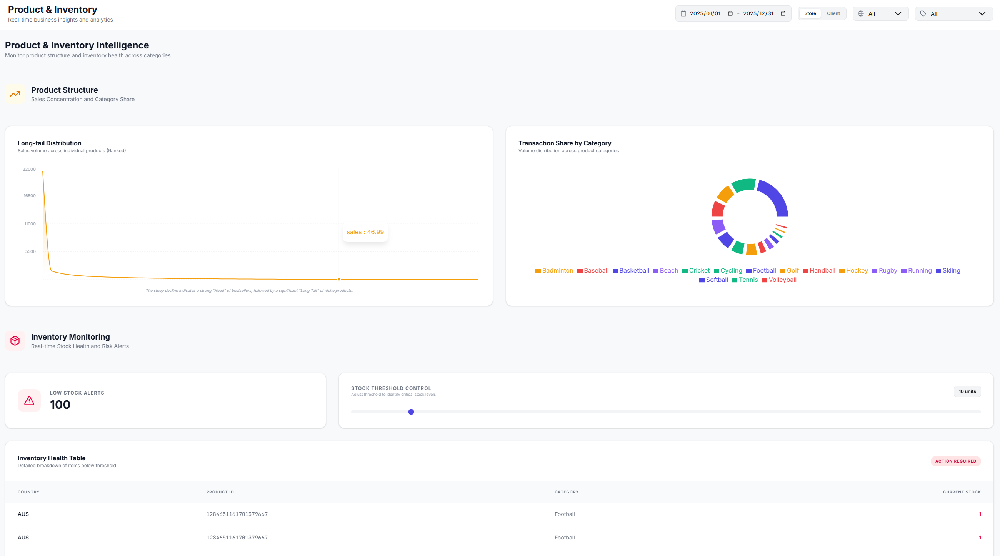
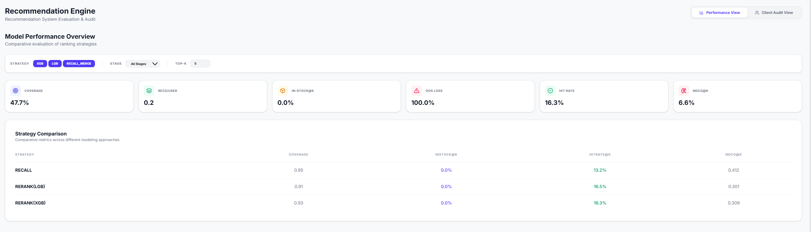
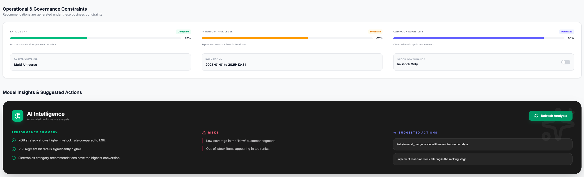
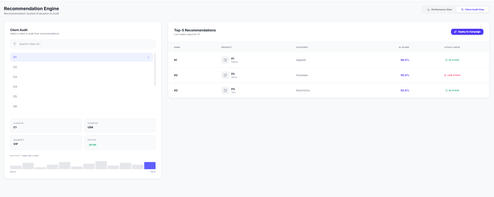

# Retail Business Intelligence Dashboard

An end-to-end **Business Intelligence Dashboard for Retail Analytics**, built with **React (TypeScript) + FastAPI**.

This project integrates **transactional data, customer information, inventory, and recommendation outputs** into an interactive dashboard designed to support business decision-making.

---

# Dashboard Preview

> Replace the images below with screenshots of your dashboard pages.

### Overview Page


### Customer Intelligence



### Product Intelligence


### Recommendation System






---

# Features

- Interactive **business overview dashboard**
- Customer segmentation and behavior analysis
- Product and inventory monitoring
- Recommendation system performance analysis
- KPI tracking for business insights
- Multi-filter exploration (date, category, segment, country)

---

# Tech Stack

### Frontend
- React
- TypeScript
- Vite

### Backend
- FastAPI
- Python
- Pandas

### Data Processing
- JSON datasets
- Custom recommendation metrics

---

# Project Structure

```
retail-bi-dashboard
│
├── backend/                # FastAPI backend APIs
│   ├── main.py
│   └── requirements.txt
│
├── frontend/               # React dashboard
│   ├── src/
│   ├── package.json
│   └── vite.config.ts
│
├── data/                   # dataset (not included due to size)
│
├── assets/                 # dashboard screenshots
│   ├── overview.png
│   ├── customer.png
│   ├── product.png
│   └── recommender.png
│
├── recommender/
├── ├── recommender.ipynb
├── README.md
└── .gitignore
```

---

# How to Run the Project

## Backend

```
cd backend
pip install -r requirements.txt
uvicorn main:app --reload
```

Backend will start at:

```
http://localhost:8000
```

---

## Frontend

```
cd frontend
npm install
npm run dev
```

Frontend will start at:

```
http://localhost:5173
```

---

# Data

The full dataset used in this project is approximately **1GB**, which exceeds GitHub’s file size limits.

Therefore, the original dataset is **not included in this repository**.

You can replace the dataset with your own data following the same schema.

---

## Recommendation Workflow

1. Generate candidate items for each customer
2. Apply ranking / reranking strategies(XGB/LGB)
3. Evaluate recommendation quality with offline metrics
4. Export results to the dashboard for business analysis

---

# Example Business Insights

This dashboard enables business users to:

- Monitor **sales performance and key KPIs**
- Analyze **customer segments and purchasing behavior**
- Track **product inventory across stores**
- Evaluate **recommendation system performance**
- Identify **out-of-stock risks and sales opportunities**

---

# Future Improvements

Possible future extensions include:

- Real-time data pipeline
- Recommendation model training pipeline
- Cloud deployment
- Advanced drill-down analytics

---

